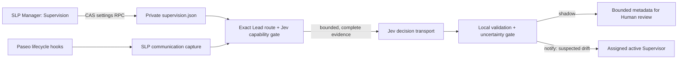

# SLP communication supervision — integration design

Status: design proposal, not implemented. Investigated 2026-09-23 against
`paseo-supervision` commit
[`1bad19b8`](https://github.com/hoangnb24/paseo-supervision/tree/1bad19b8ee6c58482494f56a3d8c6edb4f969ee1),
this SLP checkout at `d253711a`, the installed Paseo 0.8.0 SDK declarations,
and the current [Paseo plugin reference](https://paseo.sh/docs/plugins/reference.md).
This proposal changes no runtime behavior, role instructions, daemon state, or
live agents.

## Decision

Build supervision as an **opt-in capability of the existing `paseo-slp` plugin**.
The reference plugin and SLP target the same workflow: a Lead briefs a Peer,
the Peer hands work back through its assigned reporting path, and the Lead
handles the resulting obligation. The integration changes how that workflow
is scoped and observed in this package.

Supervision stays optional. Configuring Jev only makes supervision available;
it never enables observation by itself. The feature defaults off. When it is
off, SLP keeps its current provider setup, role injection, routing, and
on-demand `monitor` behavior. Enabling supervision requires a ready Jev
configuration and an explicit per-Lead selection; disabling it stops new
capture, assessment, and notifications without changing other Jev uses.
Use the reference plugin's conservative event correlation and safety gates as
the starting algorithm, but use SLP's provider registry, Jev configuration,
explicit Lead-to-Supervisor assignments, and plugin-owned state. Do not install
the reference plugin alongside SLP or copy its fixed provider names, global
recipient, environment key, or message extraction unchanged.

The first deliverable should be **shadow observation** for one explicitly bound
Lead. Notification delivery is a second gate after representative shadow cases
have been reviewed by a Human. Even in notification mode, the output is a
suspected communication issue for Supervisor review. It is never artifact
acceptance, a Lead verdict, permission to alter an assignment, or an automatic
Peer follow-up.

## Why the reference plugin cannot be used as-is

| Reference behavior | SLP consequence |
| --- | --- |
| Matches exactly `codex-lead`, `codex-peer`, `codex-supervisor` in [`server/communication.ts`](https://github.com/hoangnb24/paseo-supervision/blob/1bad19b8ee6c58482494f56a3d8c6edb4f969ee1/server/communication.ts). | SLP owns twelve `slp-<family>-<role>` provider IDs; derive role from [`plugin/shared/families.ts`](../../plugin/shared/families.ts), not a new provider list. |
| Routes every discovered Lead to one UI-selected Supervisor. | An SLP Supervisor observes only assigned Leads/projects. A shared workspace or provider does not grant that scope. Store an explicit route per Lead ID. |
| Takes the latest Peer `user_message` as the brief and last `assistant_message` as handback. | Keep that session handback path. Also capture confirmed Peer `send_agent_prompt` reports when present. SLP briefs can point to `assignmentFile`, and an assignment can name a recipient distinct from the parent; record those visibility limits before judging delivery or Lead handling. |
| Reads `JEV_API_KEY` from daemon environment and calls TypeSafe directly. | SLP already stores `jev.json` and a private per-provider key, supporting TypeSafe and OpenRouter. A second key/config would produce conflicting controls. |
| Client bootstraps persisted recipient settings into server memory after reload. | The pinned `@getpaseo/plugin@0.8.0` declaration gives `registerSettings()` a `void` result, so the server has no read/subscription handle. Use SLP's existing private state-file pattern and record this host gap. Newer online docs describe a server handle; do not assume it exists in the pinned package. |
| Begins observing and may call Jev after plugin installation. | SLP currently says it has no background semantic detector. New observation and external transmission must be separately enabled and documented in the package contract. |

The reference plugin's [`observer.ts`](https://github.com/hoangnb24/paseo-supervision/blob/1bad19b8ee6c58482494f56a3d8c6edb4f969ee1/server/observer.ts)
does offer reusable ideas: synchronous hook capture, a serialized background
queue, parent-based room membership, archive generations, matching turn-start
ordering, unknown chronology buckets, stale-assessment invalidation, recipient
refresh before send, and no automatic retry after uncertain delivery. Its
[offline verification](https://github.com/hoangnb24/paseo-supervision/blob/1bad19b8ee6c58482494f56a3d8c6edb4f969ee1/docs/VERIFICATION.md)
reports mocked tests and typecheck, not live Jev or daemon acceptance.

## Proposed ownership and data flow

`plugin/index.server.ts` registers lifecycle hooks beside its existing
`agent.create` and `agent.session_open` hooks. Keep the observer in
`plugin/server/supervision/`; shared RPC schemas and role matching belong in
`plugin/shared/`. The client adds a Supervision section to
[`ManagerSurface.tsx`](../../plugin/client/ManagerSurface.tsx), with an optional
agent-context command to prefill the selected Lead or Supervisor. The command
still saves through the same server RPC; it does not create agents.

No observer code belongs in the immutable `bin/`/`src/` runtime payload. The
plugin owns event observation while it is enabled; provider wrappers continue
to own role delivery. The existing on-demand [`src/monitor.mjs`](../../src/monitor.mjs)
remains a distinct source of cheap signal candidates.

| Planned file | Responsibility |
| --- | --- |
| `plugin/shared/supervision.ts` | Exact SLP role predicates, route and RPC schemas. |
| `plugin/server/supervision/capture.ts` | Provider-aware timeline extraction with explicit visibility states. |
| `plugin/server/supervision/observer.ts` | Lifecycle registration, chronology, cases, queue, archive generations and delivery gate. |
| `plugin/server/supervision/assessment.ts` | Jev question set, strict response validation and local verdict rules. |
| `plugin/server/supervision/state.ts` | Private route CAS and bounded metadata retention. |
| `plugin/client/cards/supervision.tsx` | Route selection, mode, gate status and shadow review list in the Manager. |
| `plugin/index.server.ts`, `plugin/index.client.tsx` | Wire and clean up the new server and client contributions. |

### Pinned host capability gaps

| Missing/limited capability | Evidence | Design response |
| --- | --- | --- |
| Server-side plugin settings read/watch in the installed 0.8.0 package | `node_modules/@getpaseo/plugin/dist/server/contracts.d.ts` returns `void` from `registerSettings`, although the current online reference describes a handle. | Use the already established private SLP state-file pattern; load it at plugin start and revalidate on the first hooked event. No client bootstrap is needed. |
| Per-item turn ID or authenticated sender on timeline messages | Paseo lifecycle and protocol 0.8.0 types; upstream [`INPUT_SHAPES.md`](https://github.com/hoangnb24/paseo-supervision/blob/1bad19b8ee6c58482494f56a3d8c6edb4f969ee1/docs/INPUT_SHAPES.md). | Use matched start/end observation order; ambiguity is unknown. |
| Proven normalized `send_agent_prompt` shape for every SLP family | Upstream investigation sampled one Codex/Meetless path. | Capture sanitized family fixtures before enabling that family. Unsupported shapes are unknown. |
| Visibility into `assignmentFile` content and whether a session-final response was read by Lead | SLP's prepare helper can put only a path in `initialPrompt`; lifecycle events do not report read receipts. | Do not read arbitrary files or infer delivery. Mark the affected axes unknown. |
| Structured report-recipient ID for a Peer assignment | SLP permits an explicit report recipient distinct from the parent for observe-existing work; the lifecycle agent record carries parentage but not the assignment route. | Capture the final session handback and any confirmed Peer sends, but leave route-compliance and Lead-receipt judgments unknown. Investigate a structured label on `create_agent` only after verifying its live MCP schema and readback. |
| Cancellation of an already issued `agents.ref(id).send()` | Paseo 0.8.0 SDK exposes a promise with no abort parameter. | Revalidate before send, bound the wait, mark before dispatch, and report uncertain outcome without retry. |

### Configuration and authority

- Add `jev.capabilities.supervision`, default `false`, to the Jev card. Show
  the enable control only after Jev has a valid enabled configuration, pinned
  provider/model, and private key. Jev setup alone never opts in. Turning the
  feature off gates new capture and assessment; turning it back on requires
  explicit per-Lead routes. The Jev card must preserve other capability keys
  on save so editing routing cannot silently turn supervision on or off.
- Store `slp-runtime/state/supervision.json` with schema version 1 and one
  route per Lead ID: `{ leadAgentId, leadWorkspaceId, supervisorAgentId,
  mode: "off" | "shadow" | "notify" }`, plus a bounded
  `pendingDelayMs` (proposed default 60 seconds). `notify` requires a Supervisor ID;
  `shadow` may keep one for later but sends no prompt. IDs are exact, never
  inferred from title, cwd, workspace, or nearest active Supervisor.
- Add typed `get-supervision` and `set-supervision` RPCs with a raw-file SHA-256
  compare-and-swap token. Write through the existing atomic private-file
  helper. Recheck the token after any awaited agent validation. An invalid or
  unreadable file means **off with a visible error**, never an empty route that
  the UI presents as a successful save.
- Extend `get-jev`/`set-jev` with a configuration revision or raw-file hash
  before adding the new capability toggle. The current Jev card writes a
  reconstructed `{routing}` capability object, so it must preserve all saved
  capability keys and reject a stale save instead of overwriting another
  client's supervision choice.
- At save time, refresh the named Lead and Supervisor through the connected
  Paseo SDK. Require an active exact SLP role provider, non-archived agent,
  matching Lead workspace, and an explicit operator selection. At every
  evaluation and before every prompt, re-read the gates and refresh the
  recipient. Archive or changed provider/status disables delivery for that
  route; there is no fallback recipient. A restored ID requires fresh active
  verification.
- The server process must bind the state path to the daemon home it actually
  serves. The existing `local-target` value is a prefill, not proof of host-home
  mapping. If the selected target cannot be verified against that process,
  reject the save and record a host capability gap instead of writing another
  daemon home's files.
- `off` captures and sends nothing. `shadow` captures and may send selected
  communication to Jev, with no Supervisor prompt. `notify` adds the alert
  path. Both active modes require a specific Human-approved Lead route and an
  explicit UI disclosure that full captured communication can leave the host.
  A missing or broken Jev configuration disables these modes while leaving
  every existing SLP feature available.
  No installation, reload, activation, or Jev routing toggle enables them.
  A persisted route loads when the plugin starts; before the first assessment
  after restart, the hook's connected SDK context verifies its agents. Cases
  from before restart are not replayed.
- A failed Jev capability/key/target gate, or an unavailable recipient in
  `notify`, pauses capture for that route and shows a reason in the Manager.
  It does not retain new message bodies or spend on assessments while delivery
  is impossible. A newly added provider family remains unsupported until its
  normalized timeline fixture and parser tests pass.

### Observation and correlation

1. Filter exact owned provider IDs using the shared family/role registry.
   Observe only Leads named in active routes and their direct Peer children,
   using `parentAgentId` from hooks and the daemon parent label on refreshed
   snapshots. Never treat common cwd/workspace as parentage. A route to a
   parentless or differently parented Lead is allowed when explicitly assigned;
   Peer membership still requires that Lead's actual parent link.
2. On `agent.created`, `agent.archived`, `agent.turn_started`, and
   `agent.turn_ended`, capture only the minimal normalized communication
   boundary synchronously and return from the hook. HTTP and SDK refresh/send
   run in a plugin-lifetime background queue, outside the hook deadline.
   Archive generations invalidate pending work and block old turns from
   restoring an archived agent. After plugin reload, a newly observed turn may
   restore discovery only after a read-only refresh verifies active parentage.
3. Peer brief: the latest `user_message` is a **candidate**, not an
   authenticated complete assignment. If it points to `assignmentFile`, or a
   source boundary is ambiguous, mark brief visibility incomplete; do not
   read arbitrary files or ask Jev to judge brief completeness. Peer handback:
   take the last `assistant_message` of a completed turn as the same
   session-visible handback the reference plugin uses. Separately capture
   confirmed `paseo.send_agent_prompt` reports from Peer to their actual
   recipient, with recipient and body as delivered-communication evidence.
   When the two bodies differ, keep their distinct provenance; never silently
   replace one with the other. If the assigned report recipient is not
   machine-verifiable, leave route compliance and whether Lead received the
   report unknown. Failed/canceled Peer turns cannot establish a completed
   session handback, although an individually confirmed send still records
   delivery.
4. Lead handling: accept only confirmed `paseo.send_agent_prompt` tool calls
   with parsed `{agentId, prompt}` and a successful structured MCP result.
   Successful individual sends on failed/canceled turns still count.
   Refresh recipients; keep messages to any direct Peer in the same Lead room,
   and include confirmed Lead reports to that route's Supervisor as a separate
   communication class. Unrelated recipients, final Lead prose, failed calls,
   and executable-wrapper text cannot prove handling. A Lead may also act
   directly; absent observable communication is **unknown**, never silence
   drift.
5. Use a monotonic callback-order counter. A Lead send is subsequent handling
   only when its matching non-null turn-start event was observed strictly after
   the Peer handback. Overlap, missing/mismatched starts, unsupported provider
   tool shapes, delivery ambiguity, or a failed recipient refresh remain
   uncertainty and locally block both closure and alert. New evidence arriving
   during an assessment invalidates that assessment before delivery.

Paseo 0.8 lifecycle payloads provide the needed event names and full timeline,
but timeline items have no per-item turn ID. The reference plugin's
[input-shape investigation](https://github.com/hoangnb24/paseo-supervision/blob/1bad19b8ee6c58482494f56a3d8c6edb4f969ee1/docs/INPUT_SHAPES.md)
establishes one normalized Codex/Meetless `send_agent_prompt` shape; it does
not establish the same shape for Pi, Devin, and Claude. Before supporting a
family in active modes, collect sanitized, read-only fixtures from that
family's actual Paseo timeline. Unsupported shapes stay unknown.

### Jev assessment and local gates

Ask three narrow typed Choice questions about applicable Lead brief quality,
Peer handback quality, and observable Lead handling. Adapt the reference
[`server/jev.ts`](https://github.com/hoangnb24/paseo-supervision/blob/1bad19b8ee6c58482494f56a3d8c6edb4f969ee1/server/jev.ts)
rubric to SLP's actual assignment, report-route, evidence, ownership, and
review-gate language. Mark every message body as untrusted data. Jev cannot
grant authority, certify an artifact, infer that a required reviewer ran, or
turn missing visibility into a violation.

Use SLP's existing Jev provider configuration and credential guard. Extend
[`plugin/server/jev.ts`](../../plugin/server/jev.ts) with a guarded resolver
and a request helper for this server-side consumer; keep endpoint, model and
redaction behavior in parity tests with [`src/jev.mjs`](../../src/jev.mjs).
The plugin compiler cannot import `src/` across its root boundary. Do not add
a second `JEV_API_KEY` path. Support the configured TypeSafe `/v1/systemone`
or OpenRouter Decisions endpoint and the configured pinned model. Before
network transmission, apply the existing
credential-shaped-string guard to the entire outgoing state; a match makes
the case unknown and emits only a bounded local reason code. Do not transmit
tool outputs, reasoning, unrelated history, raw errors, or credentials.
The outbound state contains only the bound Lead/Peer IDs, case and turn/message
IDs, the complete captured brief and session handback bodies, confirmed
room/report prompts, and visibility flags. A field that is too large or
incomplete is unknown; it is never silently shortened into apparently
complete evidence.

Only a complete, schema-valid response may influence the local decision.
Require all three answer objects; reject choices outside their declared
vocabulary, malformed distributions, ties, out-of-range or nonfinite
probabilities, a response model outside the configured provider's pin rule,
errors, and timeout. A declared `unknown` choice remains an unknown assessment
for that axis. The proposed notification threshold is `0.9` on every axis
used to justify an alert, initially fixed for the pilot; concentration is not
measured accuracy. Require observable supporting communication for a
handling-drift alert. A standalone brief/handback gap can be flagged after
the configured review delay when its body is complete and that axis is
confident, even if delivery or Lead handling is unknown; the notification
must state those limits and ask for review. A correlated observable repair
suppresses it. Delay never turns silence into handling drift. An incomplete
brief or handback body blocks judgment on that axis. Unknown report delivery
or chronology blocks handling closure and handling-drift alerts regardless of
model confidence. A confident repaired case closes only when the repair is
observable and correlated.

Keep work bounded: one serialized evaluator, with proposed pilot ceilings of
64 active cases, 128 queued events, 64 KiB of serialized evidence per case,
four Jev assessments per case, and a 24-hour case lifetime. Validate these
numbers against sanitized fixtures and the provider's input budget before
implementation; exceeding a ceiling becomes unknown with a metadata-only
diagnostic, never a truncated prompt that could be misjudged as complete.
No automatic HTTP retry. Abort in-flight HTTP on plugin stop; bound SDK waits.
Mark an alert fingerprint before `send()` because a timeout can follow a
successful delivery. Do not auto-resend an uncertain prompt. Process-local
cases, timers, and deduplication are lost on restart; do not claim exactly-once
or historical coverage.

### Shadow evidence and operator surface

The Manager shows each bound Lead, selected Supervisor, mode, current gate
status, and a bounded metadata-only observation list: timestamp, agent IDs,
turn/message IDs where available, case fingerprint, visibility/unknown reason,
Jev choice/confidence, model, token usage, and delivery state. Persist this
list in a separate private bounded ring so a daemon restart does not erase a
shadow pilot's review trail; proposed retention is at most 200 cases or 30
days, whichever comes first. Do not persist message bodies or keys in plugin
state. For a shadow review, the Human retrieves the relevant native Paseo
timeline under existing access controls and records agreement and false alert
classes outside the automatic judgment. The pilot must specify its sample and
exit criteria before the Human explicitly changes that Lead to `notify`;
there is no automatic promotion.

The UI must distinguish **observed**, **evaluated**, **unknown**, **suspected
drift**, and **notification delivery uncertain**. An empty alert list proves
none of these are healthy. Notification text cites the case fingerprint,
route, three assessments, observed message evidence and visibility limits;
it asks the Supervisor to review and contact the Lead through the assigned
route. It must never tell the Supervisor to accept work or message a Peer.

## Implementation order and acceptance gates

1. **Host evidence first:** confirm the pinned hook, settings, agent-refresh,
   parent-label and normalized tool-call shapes in this checkout and sanitized
   fixtures for each intended provider family. Record missing shapes before a
   parser workaround. Keep unsupported families off.
2. **Configuration seam:** add shared schemas, the `supervision.json` CAS RPC,
   Jev capability/UI controls and exact Lead-to-Supervisor binding. Test
   target isolation, concurrent saves, restart load, archive, bad provider,
   and disabled defaults. No lifecycle hook should call Jev yet.
3. **Shadow observer:** add capture, chronology, queue, privacy preflight,
   Jev questions/response validation, local unknown gates, bounded metadata,
   stop cleanup, and no notification path. Test synthetic cases that would
   otherwise produce false drift: different room, unobserved direct action,
   assignment-file pointer, final-only handback, overlapping turn, failed
   tool send, canceled Lead turn with a confirmed send, stale assessment, and
   archive/restore races.
4. **Notification gate:** after the Human's shadow criteria are met, implement
   `notify` with exact route refresh, generation checks, one attempt per
   fingerprint, and explicit delivery uncertainty. Test concurrent route
   changes and archive immediately before send.
5. **Documentation and live validation:** amend
   [`docs/contract.md`](../contract.md), [`docs/architecture.md`](../architecture.md),
   both READMEs, and the Manager help text to state the new detector boundary,
   external-data/cost implications, provider coverage and restart limits.
   Run local typecheck/tests and plugin compile on one stable candidate.
   Separately, with task authority, run a disposable end-to-end room through
   the requested E2E procedure. Local checks alone are not live acceptance.

Do not copy code directly without preserving the upstream Apache-2.0 notice
and recording which source commit supplied it. A clean SLP implementation of
the algorithms is preferable because its role, routing, Jev, and privacy
contracts materially differ.

## Open decisions for the implementation assignment

1. Which Lead(s) and provider families form the first shadow pilot? The
   reference repo's genuine tool-shape evidence covers only a Codex path.
2. What sample size, false-alert class, and cost ceiling must the Human see
   before `notify` is allowed? Confidence alone cannot answer this.
3. Can the live `create_agent` path carry and later expose a structured
   report-recipient label for every SLP provider? If not, route compliance
   remains outside this detector; session-visible handbacks still support
   communication-quality assessment.
